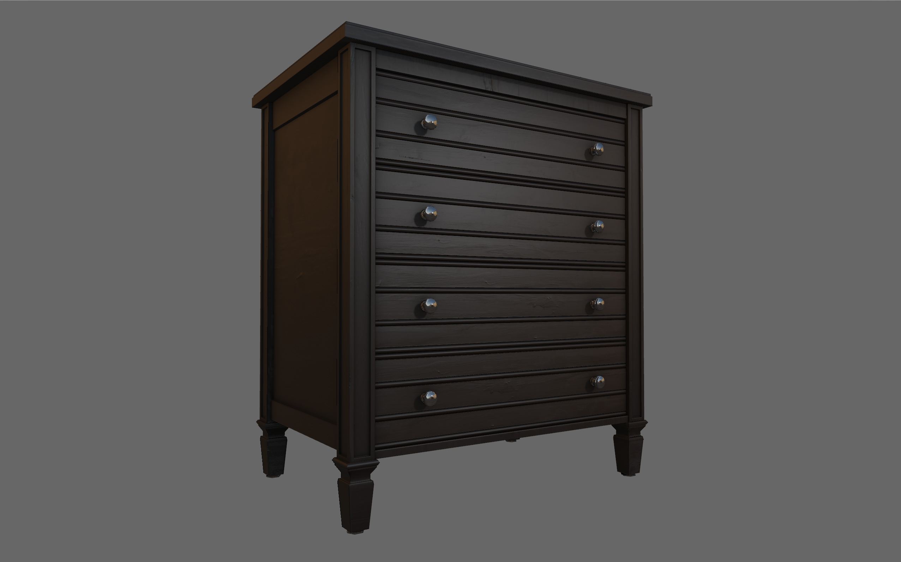

# Real-Time PBR Learning Engine

## About
This project is purely for learning purposes where I create a physically based real-time renderer and get more familiar with C++ in a graphics context.

I previously wrote a [traditional forward renderer](https://github.com/brkho/3d-engine-rust) with some bells and whistles (and a lightweight entity-component-system on top) in Rust, but I'd like to start from scratch to see what this PBR hype is all about.

This engine uses a custom model format that describes materials and gives the vertex and index information of a mesh in a format easily loadable into memory. You can convert models to this format using this [handy converter](https://github.com/brkho/eo-converter).

Currently there is an absence of documentation, so see `demo.cc` for more instructions on how to use this engine.

[Video demo](https://www.youtube.com/watch?v=NjngQDipJEk)

## Features
- Physically based material system and lighting (based on UE4). The exact material system accepts albedo, metallic, roughness, ambient occlusion, and normal maps.
- Image based lighting.
- MSAA with custom resolve for better HDR anti-aliasing.
- Skyboxes.
- Postprocess dithering to combat banding in dark scenes.
- Custom material format for quick loading.
- Real-time shadows.

## Todo
- Area lights.
- More complex shadows.
- Better GI approximation.
- Many optimizations.
- Animated meshes.

## Dependencies
This project depends on a few external libraries:
- OpenGL 3.0+
- glfw
- glad
- glm
- stb

## Contact
Brian Ho

brian@brkho.com
